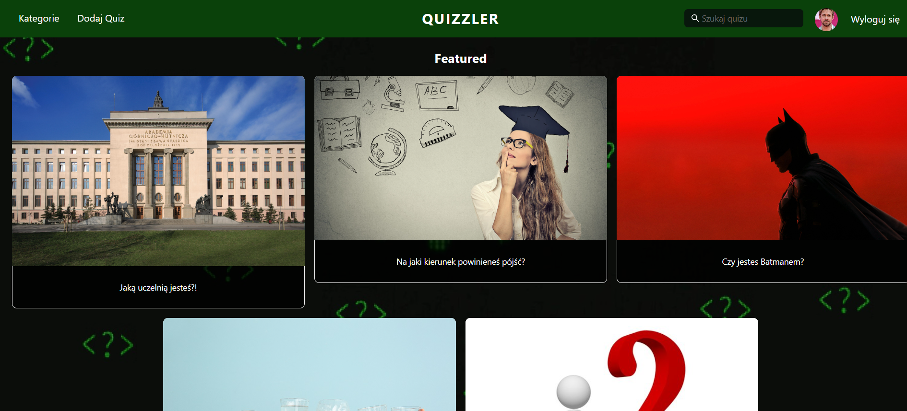
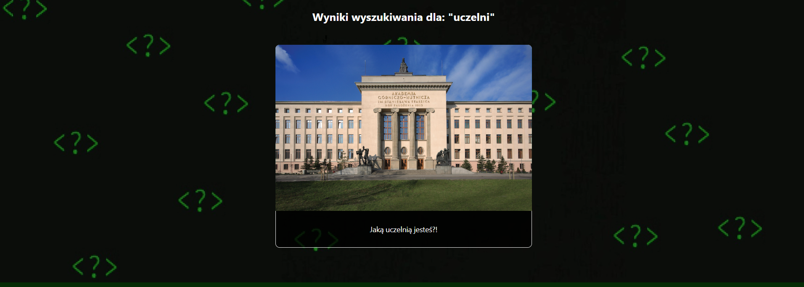
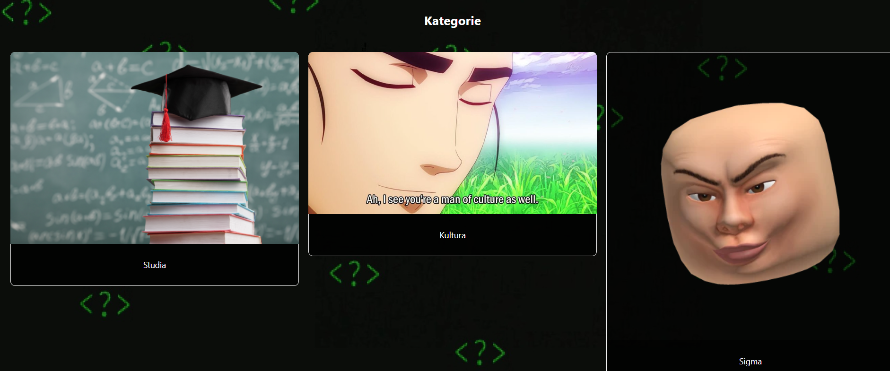
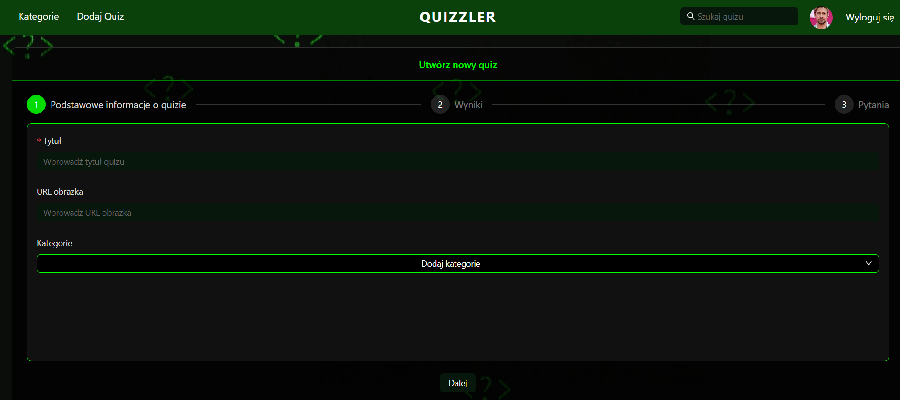
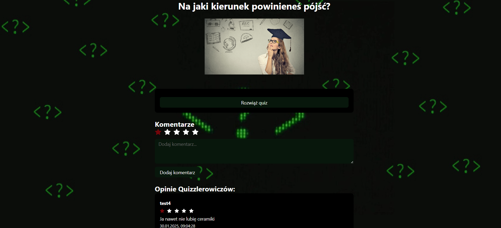

# Quizzler

by Jakub Stachecki, Krystian Bulanda, Agnieszka Dąbek

Project on Introduction to Web Applications course on AGH University of Krakow

# Documentation

## Project Description

Quizzler is a website where users can solve quizzes and add their own.

## Application Features

- Creating a new account and logging into an existing one
- Browsing quizzes, searching for them, and viewing quiz categories
- Creating a quiz
- Commenting on a quiz
- Viewing other users’ opinions/reviews
- An admin account that allows deleting all opinions/reviews

## Technologies and Libraries Used

- Backend: Express
- Frontend: React, CSS, Ant Design

# Dokumentacja

## Opis Projektu

Quizzler jest stroną, gdzie użytkownicy mogą rozwiązywać quizy oraz dodawać swoje własne.

## Funkcjonalności Aplikacji

- Tworzenie nowego konta oraz logowanie się na istniejące
- Przeglądanie quizów oraz ich wyszukiwanie, a także kategorie quizów
- Tworzenie quizu
- Komentowanie quizu
- Przeglądanie opinii innych użytkowników
- Konto admina, pozwalające na usuwanie wszystkich opinii

## Użyte technologie i biblioteki

- Backend: Express
- Frontend: React, CSS, Ant Design

## Screenshoty z Projektu

### Strona główna

### Profil użytkownika

### Wyniki wyszukiwania

### Widok kategorii

### Tworzenie quizu

### Strona quizu

